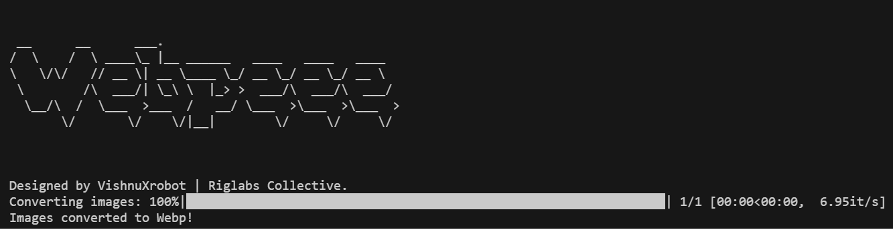

# PNG to WebP Batch Converter

This Python script converts PNG and JPG images to WebP format in batch.



## Installation

1. Clone the repository:
    ```bash
    git clone https://github.com/trynity/webp.git
    cd webp
    ```

2. Install the required packages:
    ```bash
    pip install -r requirements.txt
    ```

3. Run the script:
    ```bash
    python convert.py
    ```

## Script Details

The `convert.py` script uses the PIL library to convert PNG and JPG images to WebP format. It also utilizes the `tqdm` library for progress tracking.

## Usage

Place the PNG and JPG images you want to convert in the `images` folder. After running the script, the converted WebP images will be available in the `webp_images` folder.

## Author

Designed by VishnuXrobot | Riglabs Collective.
